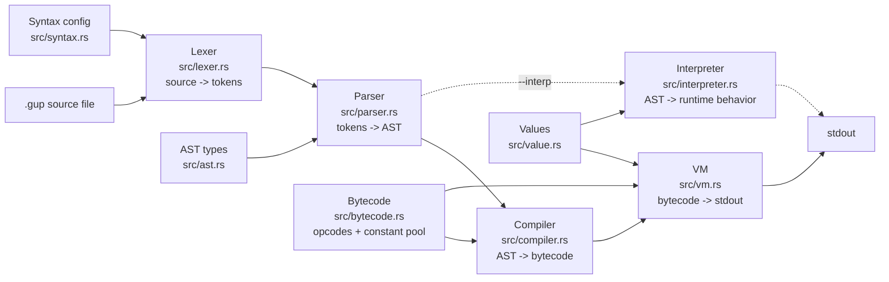

# Guppty

Guppty is a small indentation-based programming language implemented in Rust.
It reads `.gup` files, turns them into tokens and an AST, compiles to bytecode,
and runs the program on a stack-based virtual machine from the terminal.

## Install (one line)

macOS / Linux — fresh install that checks for Rust and installs it only if needed:

```bash
curl -fsSL https://raw.githubusercontent.com/adrian-1-cardona/guppty/main/install.sh | bash
```

Windows PowerShell:

```powershell
irm https://raw.githubusercontent.com/adrian-1-cardona/guppty/main/install.ps1 | iex
```

After install you can create, compile, and run your own programs:

```bash
guppty new hello
guppty compile hello.gup
guppty hello.gup
```

## Why

Guppty is meant to be simple enough to learn from and pleasant enough to extend.
The interpreter is split into clear language phases, examples double as behavior
checks, and keyword syntax lives in one place: `src/syntax.rs`.

## Quick Start (from source)

Prerequisite: install Rust once from <https://rustup.rs> (or use the one-line
installer above, which does this for you).

1. Run an example:

```bash
cargo run -- examples/program.gup
```

The VM is the default backend. Use `--interp` for the legacy tree-walking interpreter:

```bash
cargo run -- examples/program.gup --interp
```

Expected output:

```text
Hi! I am program.gup
Guppty is working!
5
```

2. Recommended (what I use): install the local `guppty` command:

```bash
cargo install --path .
guppty examples/hello.gup
```

## CLI

```text
guppty new <name>           Create a fresh .gup program
guppty compile <file.gup>   Compile to bytecode (check for errors)
guppty run <file.gup>       Run a program
guppty <file.gup>           Same as run
guppty help                 Show usage
```

## Example

```gup
add(a, b)
    return a + b

for i in range(1 through 3)
    out(add(i, 10))
```

Guppty supports variables, numbers, floats, strings, chars, booleans, arrays,
comments, `if` / `else`, `while`, `for`, functions, returns, recursion, closures,
comparison operators, and logical operators.

More examples live in `examples/`. Expected output files live in
`examples/expected/`.

## Error Messages

Guppty errors are the opposite of a Java-style stack trace: instead of a wall of
call frames, every error answers three questions right where the mistake is.

1. **Where** it happened — `file:line:column`, plus the source line with a caret.
2. **What** type of error it is — a short name like `NameError` or `SyntaxError`.
3. **How** to fix it — a single `help:` line with a concrete suggestion.

For example, running a program that uses an undeclared variable on line 3:

```text
program.gup:3:5: NameError: Variable 'oops' is not defined yet!
  |
3 | out(oops)
  |     ^^^^ NameError here
  |
  = help: Declare it first (e.g. `name = value`) or check the spelling.
```

The error types cover the whole pipeline: `SyntaxError`, `IndentationError`,
`NameError`, `TypeError`, `ValueError`, `MathError`, `ArgumentError`,
`IndexError`, `RuntimeError`, and `InternalError`. The classification and the
help suggestions live in one place, `src/error.rs`.

## Architecture



## Project Layout

```text
src/                 Rust compiler + VM (and legacy interpreter)
examples/            Runnable .gup programs
examples/expected/   Expected stdout for example tests
tests/               Integration tests for the language pipeline
design/              Grammar and syntax notes
install.sh           One-line macOS/Linux installer
install.ps1          One-line Windows PowerShell installer
docs/                Documentation site
.github/workflows/   CI for build and test checks
```

## Development

```bash
cargo test
cargo run -- examples/program.gup
```

`target/` is generated by Cargo and should stay out of git.

## Contributing

See `CONTRIBUTING.md` for the short setup and pull request notes.

## License

Guppty is available under the MIT License. See `LICENSE`.
