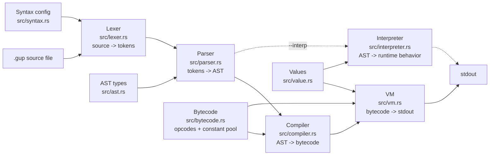

# Guppty

Guppty is a small indentation-based programming language implemented in Rust.
It reads `.gup` files, turns them into tokens and an AST, compiles to bytecode,
and runs the program on a stack-based virtual machine from the terminal.

## Install (one line)

macOS / Linux — fresh install that checks for Rust and installs it only if needed:

```bash
curl -fsSL https://raw.githubusercontent.com/adrian-1-cardona/guppty/main/install.sh | bash
```

Windows PowerShell:

```powershell
irm https://raw.githubusercontent.com/adrian-1-cardona/guppty/main/install.ps1 | iex
```

You only need to run the install command **once**. After that, `guppty` stays on
your machine and you can create, check, run, and build projects anytime:

```bash
guppty new hello
cd hello
guppty check
guppty run
guppty build
```

## Why

Guppty is meant to be simple enough to learn from and pleasant enough to extend.
The interpreter is split into clear language phases, examples double as behavior
checks, and keyword syntax lives in one place: `src/syntax.rs`.

## Make Your First Project

`guppty new hello` creates a project manifest and starter source file:

```text
hello/
├── guppty.toml
└── src/
    └── main.gup
```

Inside the project, `run`, `check`, and `build` automatically use the configured
entry file. `build` produces a standalone native executable in `build/`.

Direct file execution still works with `guppty examples/hello.gup`. The VM is
the default backend; add `--interp` to use the legacy tree-walking interpreter.

## CLI

```text
guppty new <name>                 Create a fresh project
guppty init                       Create a project in this folder
guppty run [file.gup]             Run a project or source file
guppty check [file.gup]           Check without executing
guppty build [file.gup] [-o PATH] Build a standalone executable
guppty <file.gup>                 Run a source file directly
guppty version                    Show the installed version
```

## Example

```gup
add(a, b)
    return a + b

for i in range(1 through 3)
    out(add(i, 10))
```

Guppty supports variables, numbers, floats, strings, chars, booleans, arrays,
comments, `if` / `else`, `while`, `for`, functions, returns, recursion, closures,
comparison operators, and logical operators.

More examples live in `examples/`. Expected output files live in
`examples/expected/`.

## Error Messages

Guppty errors are the opposite of a Java-style stack trace: instead of a wall of
call frames, every error answers three questions right where the mistake is.

1. **Where** it happened — `file:line:column`, plus the source line with a caret.
2. **What** type of error it is — a short name like `NameError` or `SyntaxError`.
3. **How** to fix it — a single `help:` line with a concrete suggestion.

For example, running a program that uses an undeclared variable on line 3:

```text
program.gup:3:5: NameError: Variable 'oops' is not defined yet!
  |
3 | out(oops)
  |     ^^^^ NameError here
  |
  = help: Declare it first (e.g. `name = value`) or check the spelling.
```

The error types cover the whole pipeline: `SyntaxError`, `IndentationError`,
`NameError`, `TypeError`, `ValueError`, `MathError`, `ArgumentError`,
`IndexError`, `RuntimeError`, and `InternalError`. The classification and the
help suggestions live in one place, `src/error.rs`.

## Architecture


```mermaid
flowchart LR
    Source[".gup source file"] --> Lexer["Lexer<br/>src/lexer.rs<br/>source -> tokens"]
    Lexer --> Parser["Parser<br/>src/parser.rs<br/>tokens -> AST"]
    Parser --> Compiler["Compiler<br/>src/compiler.rs<br/>AST -> bytecode"]
    Compiler --> VM["VM<br/>src/vm.rs<br/>bytecode -> stdout"]
    Parser -.->|"--interp"| Interpreter["Interpreter<br/>src/interpreter.rs<br/>AST -> runtime behavior"]
    Interpreter -.-> Output["stdout"]
    VM --> Output
    Bytecode["Bytecode<br/>src/bytecode.rs<br/>opcodes + constant pool"] --> Compiler
    Bytecode --> VM
    Syntax["Syntax config<br/>src/syntax.rs"] --> Lexer
    AST["AST types<br/>src/ast.rs"] --> Parser
    Values["Values<br/>src/value.rs"] --> VM
    Values --> Interpreter
```

## Project Layout

```text
src/                 Rust compiler + VM (and legacy interpreter)
install.sh           One-line macOS/Linux installer
install.ps1          One-line Windows PowerShell installer
examples/            Runnable .gup programs
examples/expected/   Expected stdout for example tests
tests/               Integration tests for the language pipeline
design/              Grammar and syntax notes
docs/                Documentation site
.github/workflows/   CI for build and test checks
```

## Development

```bash
cargo test
cargo run -- examples/program.gup
cargo install --path .
```

`target/` is generated by Cargo and should stay out of git.

## Contributing

See `CONTRIBUTING.md` for the short setup and pull request notes.

## License

Guppty is available under the MIT License. See `LICENSE`.
